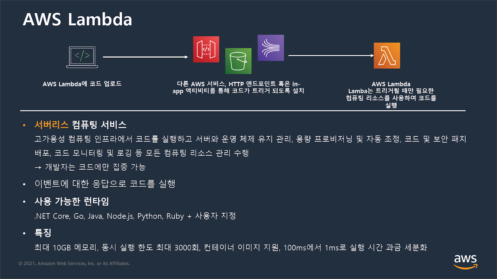
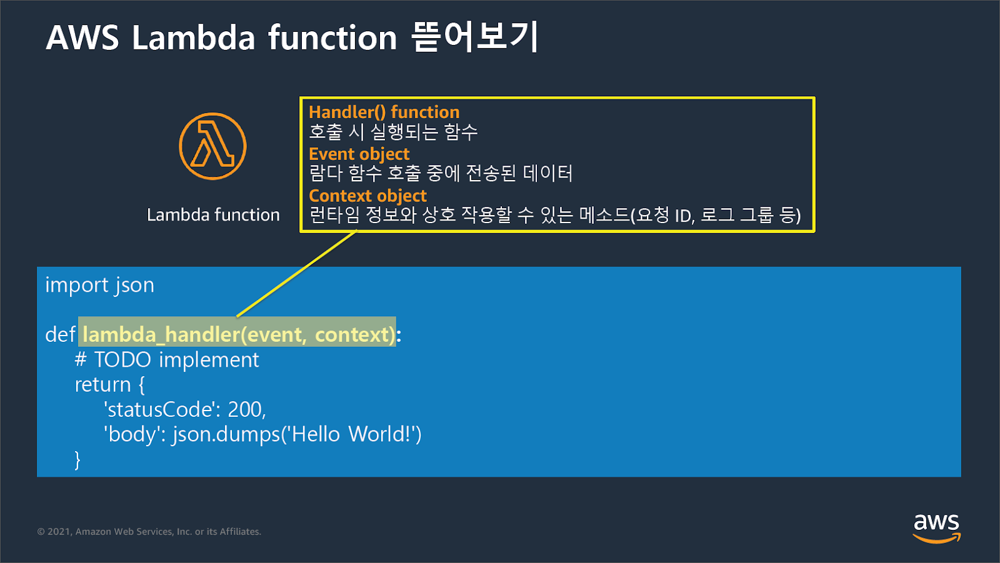
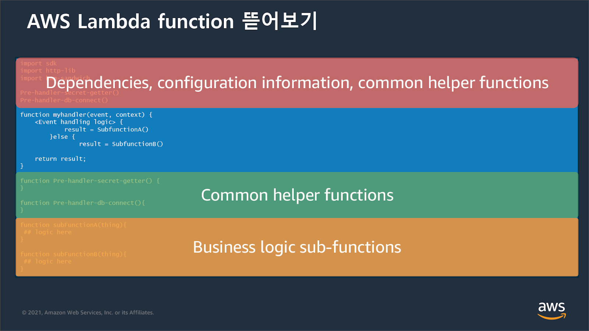
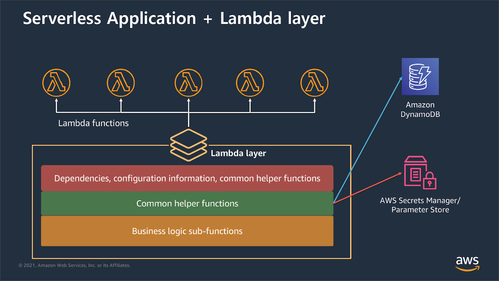

# **AWS Lambda**

[클라우드 컴퓨팅 PaaS | Amazon Web Services](https://aws.amazon.com/ko/lambda/)

* 서버리스 서비스의 종류
* 작은 프로그램을 실행하는 구조이며, 미리 등록해두면 언제든지 실행 가능
* Lambda는 주로 S3와 조합하여 사용한다.
* 데이터나 요청에 대한  실시간 처리나 백엔드 처리를 자동으로 실행하는 구조
* 프로그램 실행시에만 과금
* **Lambda 함수**라는 형식의 함수를 사용하지만 새로운 프로그램언어는 아니며 잘알려진 프로그래밍 언어로 작성한 코드를 바탕으로 ‘ **Lambda 콘솔** ’을 사용하여 GUI로 만들 수 있다.

# Lambda Layer

## 특징

* 손쉬운 코드 공유
  Layer에 한 번 업로드하면 어떤 Lambda function에서든 쉽게 참조 가능
* 공통 구성 요소( 공통된 코드, 라이브러리 번들(로깅), 사용자 지정 런타임)를 ZIP 파일에 넣고 업로드
* Layer에 포함될 수 있는 것:
  dependencies, training data, configuration file 등
* 업데이트 관리를 위해 버전 지원
* 할당향
  함수 당 최대 5개 layer 사용 가능
* 함수 + 모든 layer의 압축되지 않은 총 크기 < 250MB
* Layer들은 함수 실행 환경에서 /opt 디렉터리로 추출

## 장점

* 배포 패키지를 작게 유지 가능
* 책임 분리를 가능하게 하며 개발자가 비즈니스 로직 작성을 더 빠르게 반복 가능
* 빌트인된 안전한 공유 환경 지원
* 환경을 커스터마이징 가능
  EX) 하나의 레이어는 custom runtime으로 다른 레이어는 함수에 필요한 라이브러리로 구성
