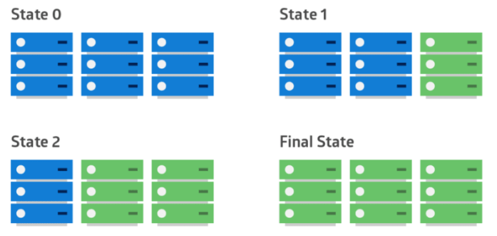
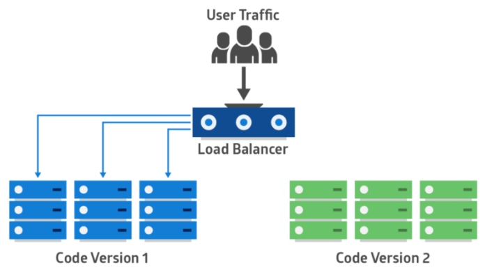
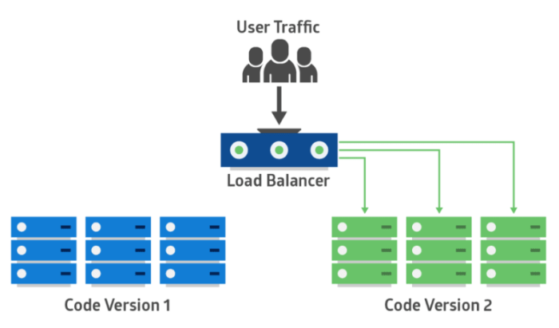
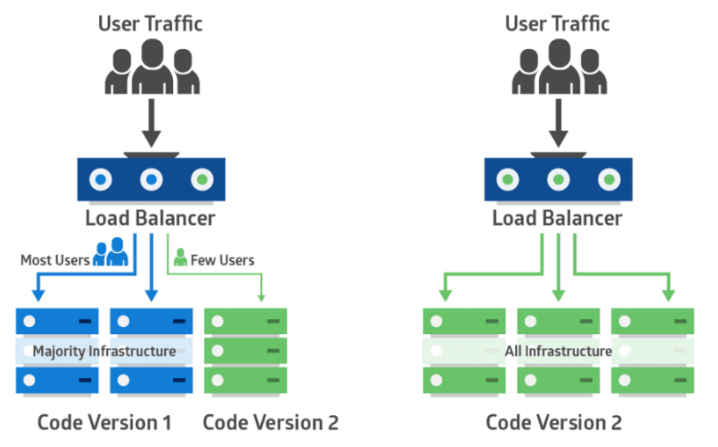

## **빅뱅 배포**

애플리케이션의 전체 또는 대부분을 한 번에 업데이트

## **롤링 배포 = 단계적 배포**

애플리케이션의 이전 버전(파란색)을 점차적으로 새 버전(초록색)으로 교체

## **Blue-Green, Red-Black, A/B 배포**

두 개의 동일한 프로덕션 환경이 병렬로 작동

하나는 모든 사용자의 트래픽을 수신하는 실행 상태, 다른 하나는 유휴 상태

새로운 버전의 애플리케이션은 그린 환경에 배포되고 기능 및 성능 테스트를 수행

테스트 결과가 성공이면 애플리케이션의 트래픽을 파란색에서 초록색으로 라우팅(변경)

초록색이 활성화된 후 문제가 발생하면 트래픽을 다시 파란색으로 라우팅

Blue-Green 배포에서는 두 시스템 모두가 동일한 지속 계층 또는 데이터베이스 백엔드를 사용해야 함

## **카나리아(canary) 배포**

프로덕션 인프라의 작은 부분에 새 애플리케이션 코드를 배포해서 소수의 사용자만 해당 애플리케이션으로 라우팅

보고된 오류가 없는 새 버전은 나머지 인프라에 점차적으로 롤 아웃

