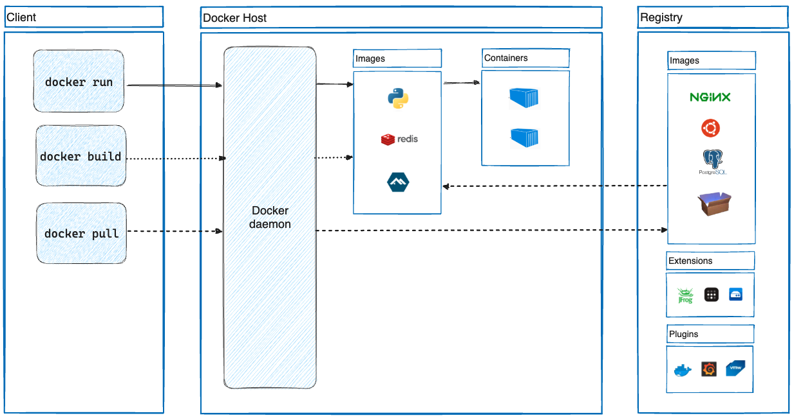
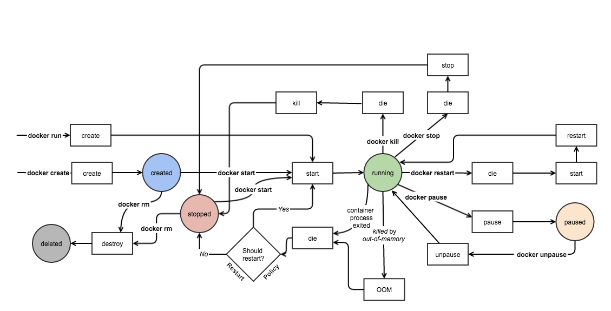
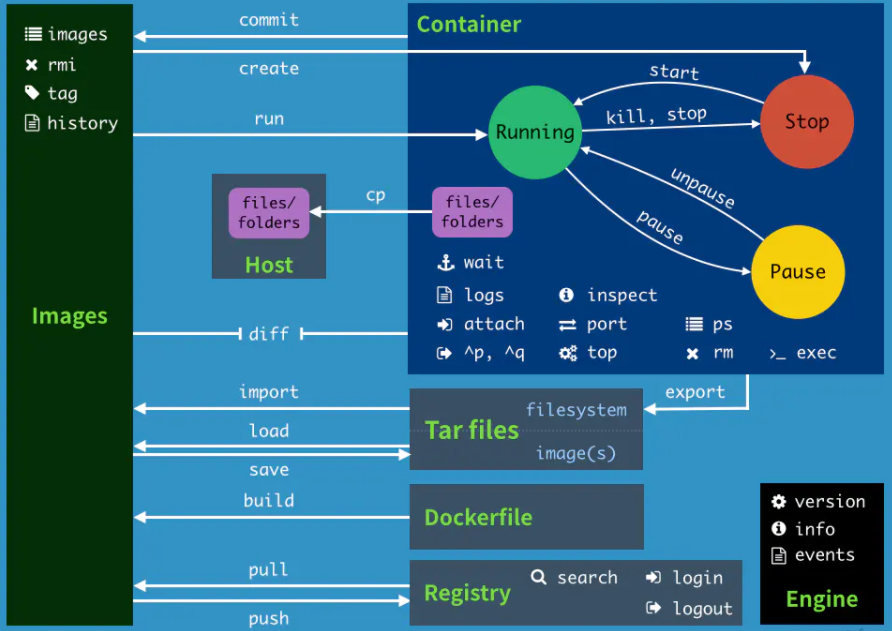

## **도커 구성 요소**

https://docs.docker.com/get-started/overview/#docker-architecture

### **Docker daemon (dockerd)**

- 도커 API 요청을 수신
- 도커 이미지,컨테이너, 네트워크, 볼륨과 같은 도커 객체를 관리
- 도커 서비스를 관리하기 위해 다른 데몬과 통신

### Client (docker)

- 도커 사용자가 도커와 상호작용 하는  기본 방법
- 도커 사용자의 명령을 도커 API를 사용해서 도커 데몬으로 전달
- 하나 이상의 도커 데몬과 통신이 가능

### Registry

- 도커 이미지 저장소
- 도커 이미지를 저장하고 배포하는 표준 방법
- 퍼블릭 저장소와 프라이빗 저장소

## **도커 객체(docker objects)**

### **이미지**

- 컨테이너를 생성할 때 필요한 요소 (가상머신을 생성할 때 사용하는 가상머신 이미지 또는 ISO 파일과 비슷한 개념)
- 여러 개의 계층으로 된 바이너리 파일로 존재
- 컨테이너를 생성하고 실행할 때 읽기 전용으로 사용됨
- 저장소(registy)/리포지토리(repository)/태그(tag)

### **컨테이너**

- 도커 이미지로 생성한 해당 이미지의 목적에 맞는 파일이 들어 있는 파일 시스템과 격리된 시스템 자원 및 네트워크를 사용할 수 있는 독립된 공간
- 컨테이너는 **이미지를 읽기 전용**으로 사용하되 **이미지에서 변경된 사항만 컨테이너 계층에 저장**하므로 컨테이너에서 무엇을 하든지 원래 이미지는 영향을 받지 않음
- 생성된 컨테이너는 각기 **독립된 파일 시스템**을 제공받으며 **호스트와 분리**돼 있으므로 특정 컨테이너에서 어떤 애플리케이션을 설치하거나 삭제해도 다른 컨테이너와 호스트는 변화가 없음

# **도커 컨테이너 라이프사이클**

