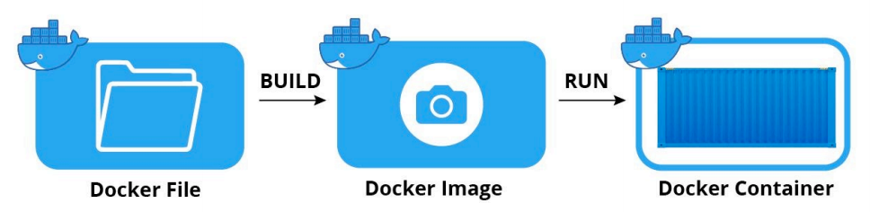
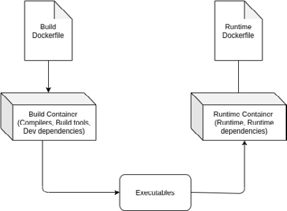

# 1. commit 커맨드를 **이용한 도커 이미지 빌드**

컨테이너를 준비한 후 컨테이너를 이미지로 변환하는 방법

```docker
docker commit 컨테이너_이름 새로운_이미지_이름
```

# 2. **Dockerfile을 이용한 도커 이미지 빌드**



[Dockerfile reference](https://docs.docker.com/engine/reference/builder/)

**도커 이미지를 빌드**하는데 필요한 **모든 명령어**를 순서대로 기술한 **텍스트 파일**

## **docker image build = docker build**

* **Dockerfile** 및 **컨텍스트(context)**에서 Docker 이미지를 빌드할 때 사용하는 명령
* Dockerfile을 사용하면 직접 컨테이너를 생성하고 이미지로 커밋해야 하는 번거로움을 덜 수 있을 뿐 아니라 깃과 같은 개발 도구를 통해 애플리케이션의 빌드 및 배포를 자동화할 수 있음

> **Dockerfile :**
> 컨테이너에 설치해야 하는 패키지(FROM), 추가해야 하는 소스코드(ADD, COPY), 실행해야 하는 명령어와 쉘 스크립트(RUN, CMD) 등을 기록한 파일

> **컨텍스트(context) :**
> 지정된 경로(PATH) 또는 URL에 있는 파일 세트
> build 프로세스는 컨텍스테에 있는 모든 파일을 참조할 수 있음

```docker
docker build -t 이미지_이름:태그_이름 경로 재료_폴더_경로
```

<aside>
💡 **주의** : docker image build -t example/echo:latest .

</aside>

Dockerfile이 위치하는 곳에서 이미지를 빌드한다면 . 를 꼭 찍자

**Dockerfile 스크립트 예**

```docker
# 인스트럭션 내용

FROM 이미지 이름
COPY 원본_경로 대상_경로 
RUN 리눅스_명령어
...
```

## **Dockerfile 모범 사례**

도커 이미지 빌드 시간 단축, 이미지 크기 감소, 보안 강화 및 유지 관리 가능성을 보장

### **#1 적절한 베이스 이미지 사용**

### **#1-1 도커 허브 공식 이미지를 사용**

도커 허브의 공식 이미지는 모범 사례를 따르고 문서화되어 있으며 보안 패치가 적용되어 있음

| **Inefficient Dockerfile**                                             | **Efficient Dockerfile** |
| ---------------------------------------------------------------------------- | ------------------------------ |
| ex) FROM ubuntu<br />RUN  apt-get update && apt-get install -y openjdk-8-jdk | ex) FROM openjdk               |


### **#1-2 특정 버전의 태그 사용**

프로덕션 환경을 위한 도커 이미지를 빌드할 때 베이스 이미지에 latest 태그를 사용하면 하위 호환성을 제공하지 않을 경우 문제가 될 수 있음

| Inefficient Dockerfile  | Efficient Dockerfile |
| ----------------------- | -------------------- |
| ex) FROM openjdk:latest | ex) FROM openjdk:8   |

### **#1-3 최소 크기의 이미지를 사용**

최소 크기 버전의 부모(베이스) 이미지를 사용 → 최소 크기의 도커 이미지를 생성

alpine linux 이미지를 중심으로 빌드된 최소 크기 이미지 또는 빌드 도구가 포함된 JDK 대신 JRE를 사용하여 어플리케이션을 실행해야 함

| **Inefficient Dockerfile** | **Efficient Dockerfile**           |
| -------------------------------- | ---------------------------------------- |
| FROM openjdk:8<br />⇒ 488MB     | FROM openjdk:8-jre-alpine<br />⇒ 84.9MB |

### **#2 루트가 아닌 사용자로 컨테이너를 실행**

도커 컨테이너는 기본적으로 루트(id=0) 사용자로 실행, 따라서, 해커가 도커 컨테이너 내부에서 실행되는 애플리케이션을 해킹한 후 도커 호스트에 대한 루트 액세스 권한을 얻을 수 있다.

이로 인해 프로덕션 환경에서 루트 사용자로 도커 컨테이너를 실행하는 것은 좋지 않은 보안 관행으로 간주

**응용 프로그램 실행에 필요한 최소한의 권한만 갖도록 최소 권한의 원칙을 준수**

* --user (또는 -u) 옵션을 사용
* USER 지시문 사용

# 3. 빌더 패턴

* 최적 크기 도커 이미지를 생성하기 위해 사용하는 방법
* 두 개의 도커 이미지를 사용
  * 첫 번째 도커 이미지 ⇒ Builder ⇒ 소스 코드를 실행 파일로 만들기 위한 빌드 환경 ⇒ 빌드에 필요한 컴파일러, 빌드 도구 , 개발 종속성 등을 포함
  * 두 번째 도커 이미지 ⇒ Runtime ⇒  첫 번째 도커 컨테이너가 생성한 실행 파일을 실행하기 위한 런타임 환경 ⇒ 실행 파일, 종속성 및 런타임 도구만 포함
  * **첫 번째 도커 컨테이너가 생성한 실행 파일을 두번째 도커 컨테이너로 전달하는 스크립트가 필요**



# 4. 다단계 도커 빌드

* Docker 17.05 버전에 새롭게 추가된 기능
* 하나의 Dockerfile에 여러 개의 FROM 문을 사용해 빌드 단계를 정의하고,
  --from 플래그를 사용해 각 단계에서 생성된 아티팩트 참조가 가능하도록 하는 것
* 각 단계는 0부터 순서대로 부연된 번호 또는 AS 절을 사용해 부여한 별칭을 이용할 수 있음
