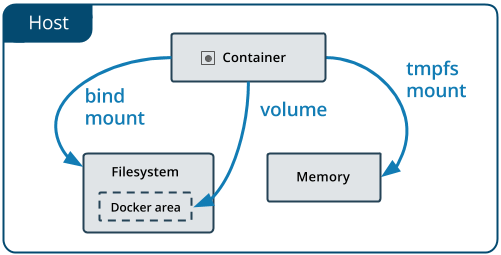

# **도커에서 데이터 관리**

## **volume**

* 호스트의 파일 시스템 내에 특정 영역(리눅스의 경우, /var/lib/docker/volumes/)을 도커가 사용, 관리
* 도커가 아닌 다른 프로세스에서는 해당 영역 접근이 불가능
* 가장 추천하는 방식

## **bind mount**

* 호스트의 파일 시스템 자체를 사용
* 호스트와 컨테이너가 설정 파일을 공유하거나 호스트에서 개발하고 컨테이너로 배포하는 방식으로 사용

## **tmpfs mount**

* 호스트의 파일 시스템 대신 메모리에 저장하는 방식
* non-persistent data를 다룰 때는 tmpfs mount가 가장 좋음

## -**v 또는 --mount 옵션**

-v 볼륨이름 : 마운트경로 : 옵션

* **볼륨이름**
  명명된 볼륨의 경우 볼륨의 이름을, 익명 볼륨의 경우 생략
  호스트에서 유일한 값을 가짐
* **마운트경로**
  파일이나 디렉터리가 컨테이너에 마운트되는 경우
* **옵션**
  ro : 읽기 전용
  쉼표로 구분
