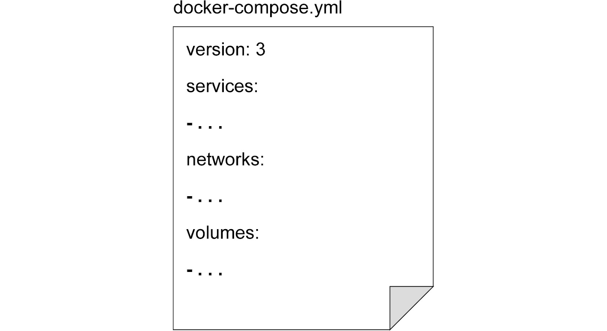
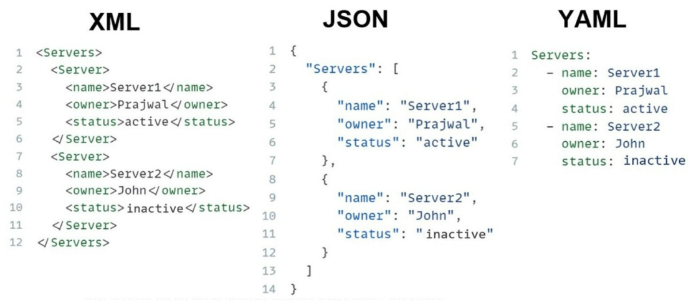
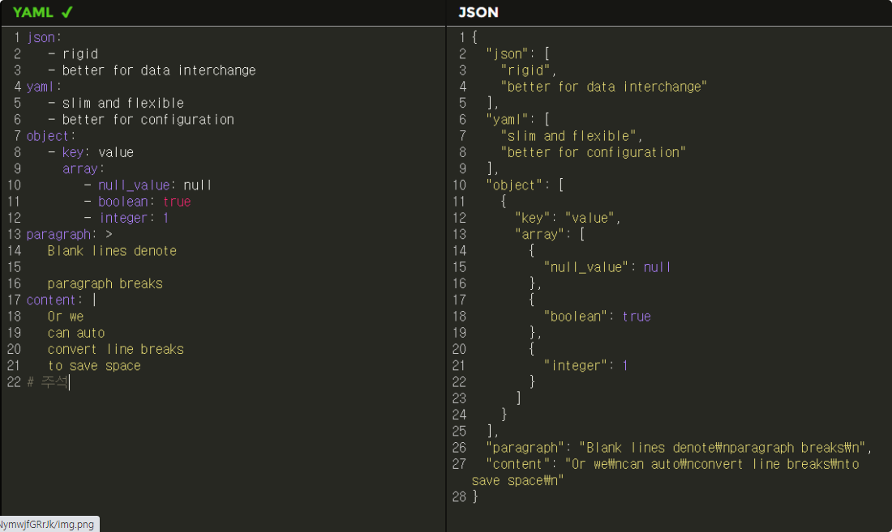

# **Docker Compose**

[https://docs.docker.com/compose/](https://docs.docker.com/compose/)

> Compose is a tool for defining and running multi-container Docker applications. With Compose, you use a YAML file to configure your application's services. Then, with a single command, you create and start all the services from your configuration.

## **docker-compose.yaml (docker-compose.yml) 파일 구조**

* Docker Compose를 사용하여 여러 도커 컨테이너를 정의하고 관리하는 데 사용되는 설정 파일
* YAML(YAML Ain't Markup Language) 형식으로 작성
* 여러 서비스, 네트워크, 볼륨 및 환경 변수와 같은 컨테이너 관련 설정을 지정

* **version :** Docker Compose 파일 버전 (현재는 3이 가장 일반적으로 사용)
* **services :** 컨테이너 서비스를 정의
  * 서비스 이름과 해당 서비스에 대한 설정을 정의
  * 각 서비스는 독립적인 컨테이너로 실행
* **networks :** 서비스에서 사용할 네트워크에 대한 설명
* **volumes :** 서비스의 컨테이너에서 마운트될 데이터 볼륨에 대한 설명

